# Customer Churn Analysis

## Introduction

- In today's competitive business environment, retaining customers is crucial for long-term success. Churn analysis is a key technique used to understand and reduce this customer attrition.
- This is a Power BI and SQL project on churn analysis of an imaginary telecommunication company. This project is to examine customer data to identify patterns and reasons behind customer departures. And use advanced data analytics and machine learning, to predict which customers are at risk of leaving and understand the factors driving their decisions.
---
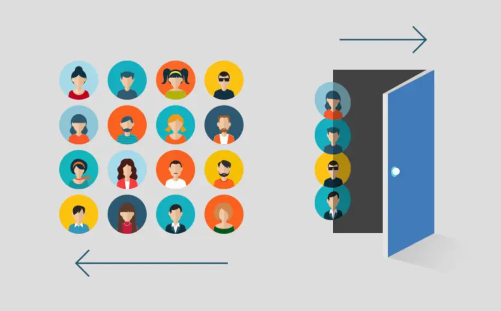
---
## Problem Statement
1. Are there specific demographic segments like age and gender, that are more likely to churn?
2. Are there regional variations in churn rates?
3. Which services or bundles are associated with higher churn rates?
4. Can we develop a predictive model to identify customers at risk of churning before they leave?

## Data Sourcing

The Customer Data csv file contains 6418 rows with 32 columns

## Skills Demonstrated

The following SQL features were incorporated;
- Query Writing
- Data Modification; This includes INSERT, UPDATE, DELETE
- Filtering and Sorting
- Aggregation
- Subqueries
- Indexing
- Views
- Transactions

The following Power BI features were incorporated;
- DAX
- Quick Measures
- Page Navigation
- Filters
- Tooltips
- Button
--- 
## Data Transformation
### Data Cleaning:

- Handling Null Values: The code uses the ISNULL function to replace null values with default values like "None" or "No" for certain columns. This ensures data consistency and avoids errors during analysis.

Identifying Null Values                        |          Removing Null Values
:---------------------------------------------:|:------------------------------------:
  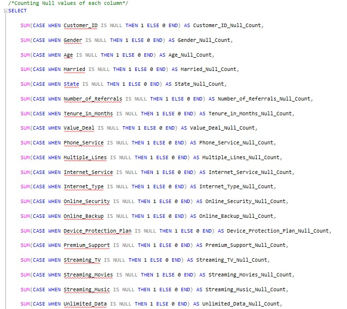                         |            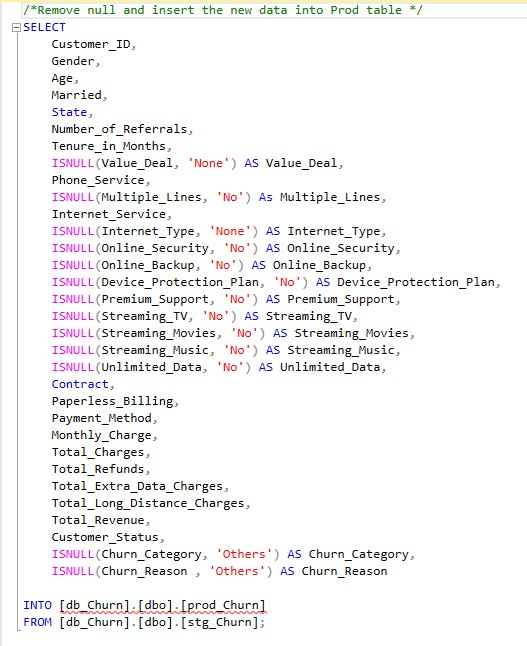
  
### Data Type Conversion: 
- Converted the Bit data type to Varchar(50) to address compatibility issues with the Import Wizard.

### Data Validation:
- Set a primary key (CustomerID) to prevent duplicate entries in the data.

### Data Exploration:
- The code uses SELECT, COUNT, and GROUP BY to explore the data and understand its characteristics.

 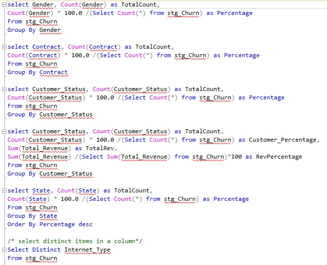

### Create View for Power BI
 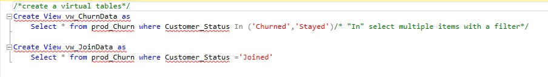
--- 
## Modelling

Power BI automatically connected related tables resulting in a star schema model. 

 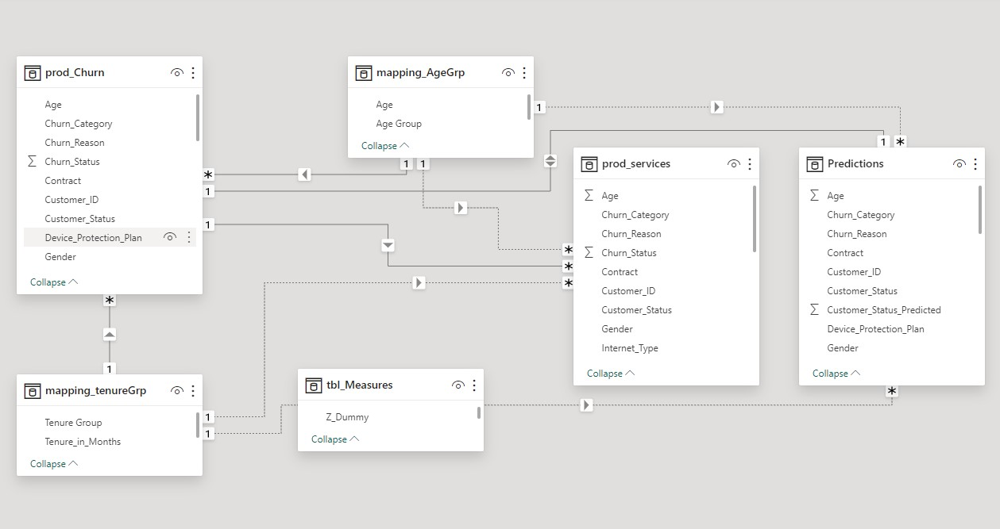

Create a Power BI dashboard to utilize the Customer Data and achieve below goals:
- Visualize & Analyse Customer Data at below levels
- Demographic
- Geographic
- Payment & Account Info
- Services
- Study Churner Profile & Identify Areas for Implementing Marketing Campaigns
- Identify a Method to Predict Future Churners
 
Metrics Required

- Total Customers
- Total Churn & Churn Rate
- New Joiners

## Power BI Visualization

### Churn Analysis Summary Dashboard

## Predict Customer Churn

For predicting customer churn, used Machine Learning algorithm called RANDOM FOREST.

### What is Random Forest?
A random forest is a machine learning algorithm that consists of multiple decision trees. Each decision tree is trained on a random subset of the data and features. The final prediction is made by averaging the predictions (in regression tasks) or taking the majority vote (in classification tasks) from all the trees in the forest. This ensemble approach improves the accuracy and robustness of the model by reducing the risk of overfitting compared to using a single decision tree.

### Importing Libraries & Data Load and Data Preprocessing 
Data Load                                      |         Data Preprocessing
:---------------------------------------------:|:------------------------------------:
  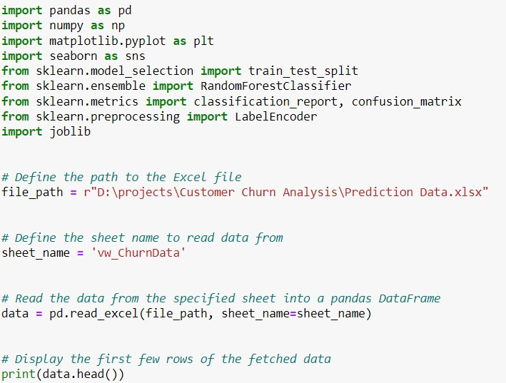                            |            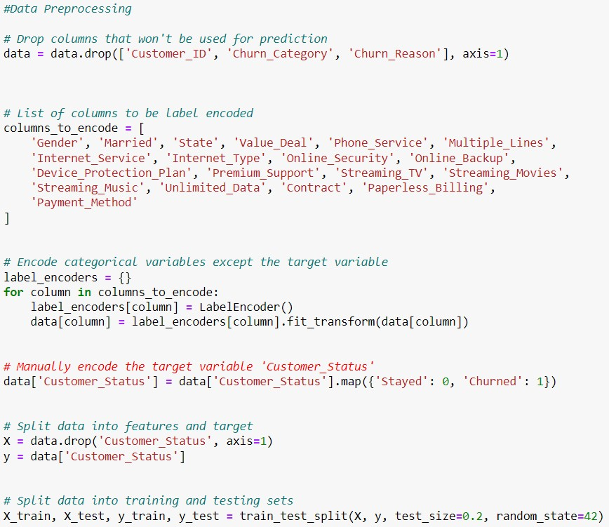
  
### Train Random Forest Model
  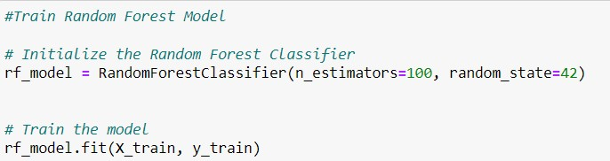   

### Evaluate the Model and Prediction on New Data

Evaluate the Model                             |        Prediction on New Data
:---------------------------------------------:|:------------------------------------:
  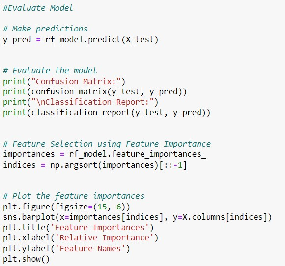                            |            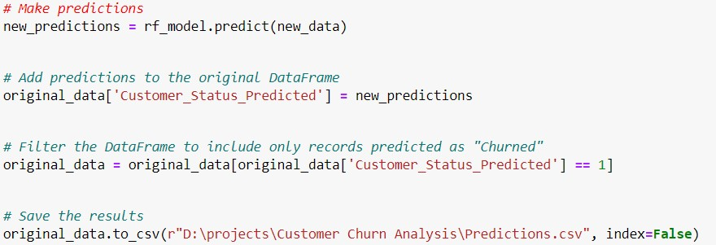
  
## Power BI Visualization of Predicted Data
### Churn Prediction Dashboard

## Insights

Based on the dashbioards, here are some insights:
### Demographic Analysis:
- Gender: Female customers have a higher churn rate compared to male customers.
- Age: The 20-35 age group has the highest churn rate, followed by the 35-50 age group.
- Customers aged <20 and >50 have lower churn rates.

### Service and Bundle Analysis:
- Contract Type: Customers with Month-to-Month contracts have a significantly higher churn rate compared to those with one-year or two-year contracts.
- Payment Method: Credit card payments are associated with a higher churn rate compared to bank withdrawal or mailed check.

### Overall Insights:
- Customer Loyalty: Customers with longer tenure (>=24 months) and those who are married are more likely to stay.
- Contract Type: Offering longer-term contracts with incentives can help reduce churn.
- Payment Method: Exploring alternative payment methods or providing incentives for specific payment methods might be beneficial.
- Service Bundling: Analyzing the churn rates associated with different service bundles can help identify areas for improvement or optimization.
